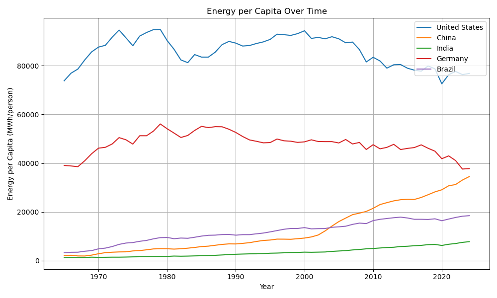
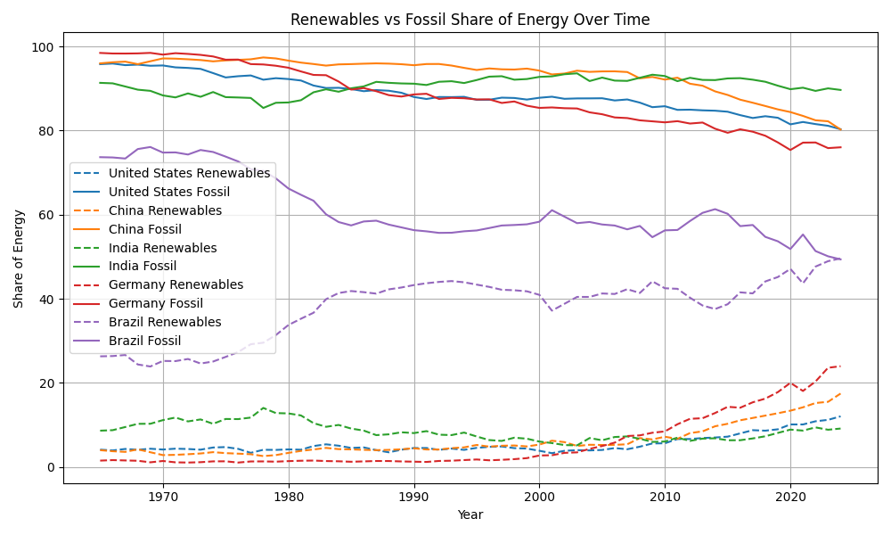
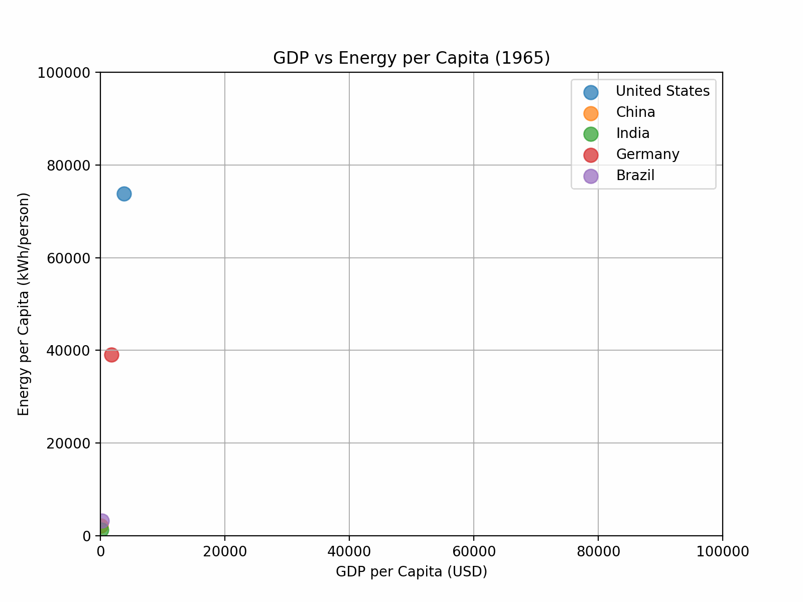
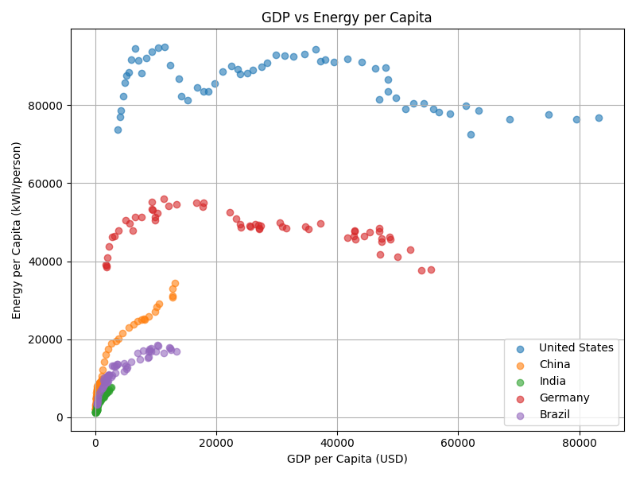
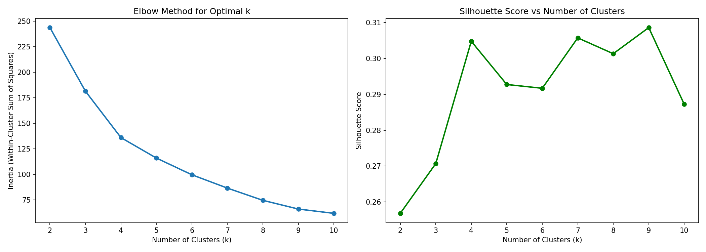
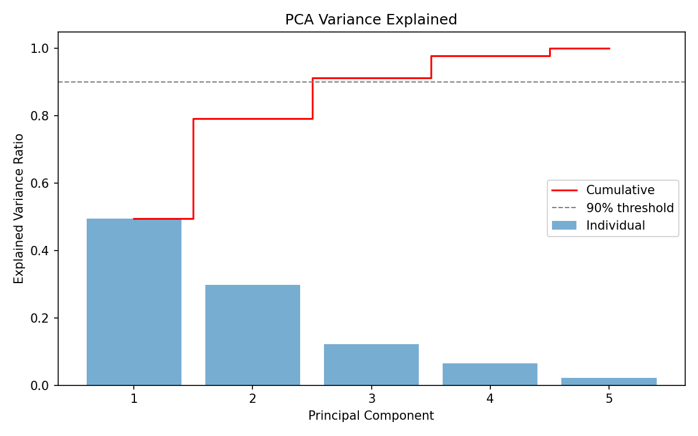

# CS506 Project — Global Energy Consumption Modeling

**Final Video Presentation:** https://youtu.be/BJZWWlMpbNk

---

## 1. How to Run the Project 

To reproduce all results, run:

```bash
git clone https://github.com/JiaLiiin/CS506-Project
cd CS506-Project
make install
make run-all
```

The `Makefile` executes the full pipeline:

- Data collection (OWID + World Bank API)
- Data cleaning and preprocessing  
- Feature engineering  
- Exploratory data analysis (EDA)  
- Model training and evaluation 
- Model comparison visualizations  
- PCA + K-Means clustering   

---

## 2. Tests + GitHub Workflow

### Tests

Located in `/tests`.

Run locally:

```bash
pytest
```

### What is Tested 

- Data loads correctly  
- Required columns exist   
- Predictions are valid:
  - no NaNs  
  - non-negative values  

### GitHub Actions (CI)

Located in:

```
.github/workflows/tests.yml
```

Automatically:

- installs dependencies  
- runs tests on every push  

Ensures reproducibility and prevents broken code.

---

## 3. Project Overview

This project examines global energy consumption patterns and their relationship with economic indicators at the country level, with a focus on how energy use varies across countries and over time.

This project aims to:

1. **Predict energy consumption per capita** for countries over time  
2. **Understand how energy use evolves across development stages**  

To achieve these goals, we leverage economic and energy-related features such as GDP, population, population density, and energy mix composition. The analysis also explores the relationship between GDP per capita and energy consumption per capita, and investigates trends in fossil fuel and renewable energy usage across countries through statistical analysis and visualizations.

---

## 4. Data Collection

### Data Sources

This project combines:

- OWID Energy Dataset (Our World in Data)  
- World Bank GDP Data

### Why These Sources? 

- OWID → comprehensive energy metrics  
- World Bank → reliable GDP data  

### Data Collection Method

The OWID dataset provides country-year energy metrics. However, GDP values were replaced using World Bank data to ensure consistency and completeness.

Steps:
  1. Load OWID dataset  
  2. Remove existing GDP column  
  3. Fetch GDP via API  
  4. Merge on (country, year) 

---

## 5. Data Cleaning

### Country Filtering
- Removed countries with >40% missing values  
- Removed aggregate regions by `iso_code` (e.g., World)

### Missing Values
- Target (`energy_per_capita`): dropped (~15 rows) 
- GDP: linear interpolation within country, then forward/back fill for edges  
- Energy shares: forward/backward fill

### Rationale

These choices preserve temporal consistency and avoid introducing bias from cross-country imputation.

---

## 6. Feature Engineering

### Selected Features
- year
- log_gdp_per_capita  
- log_population  
- coal_share_energy  
- gas_share_energy  
- oil_share_energy  
- nuclear_share_energy  
- hydro_share_energy  
- solar_share_energy  
- wind_share_energy  
- biofuel_share_energy

These features were selected because they capture the primary drivers of per capita energy consumption. GDP per capita reflects economic activity, infrastructure development, and overall wealth, all of which strongly influence energy use. Population captures the scale and distribution of demand, with log transformations helping account for skewness and non-linear growth patterns. Energy mix shares (expressed as percentages of total consumption) provide insight into how energy is produced and consumed, allowing the model to capture differences in efficiency, technology, and resource dependence across countries.
 
### Dropped Features

Dropped high-missing and redundant features: 

- Aggregate shares (redundant)  
- Green house gas emissions (>50% missing)

Aggregate features such as total renewable and fossil energy shares were removed because they are redundant with their component variables. Additionally, greenhouse gas emissions were excluded due to high missingness, making reliable imputation impractical.

### Transformations
- Log transform applied to GDP and population to reduce skew
- Target transformed with log1p, predictions converted back using expm1

### Final Dataset

- Time range: 1965–2024  
- Countries: 69  
- Rows after cleaning: 3,885  

---

## 7. Exploratory Data Analysis (EDA)

### 1. Energy Per Capita Over Time


Energy consumption varies widely across countries. The United States maintains the highest levels, while China exhibits rapid growth, especially between 2000 and 2010. India and Brazil show gradual increases, while developed countries plateau.

---

### 2. Energy Mix Transitions


All countries begin heavily fossil-dependent. Germany shows the largest renewable transition, Brazil reaches near parity, while India shows minimal structural change.

--- 

### 3. GDP vs Energy Consumption (Scatter + Animation)



A strong positive relationship exists at low income levels, weakening at higher levels. This confirms a **nonlinear relationship between GDP and energy consumption**.

--- 

### Key Insights

- Energy consumption is highly unequal across countries  
- Developed countries plateau at high consumption levels  
- China shows rapid growth post-2000  
- Energy transitions differ significantly:
  - Germany → strong renewable transition  
  - Brazil → balanced mix  
  - India → slow structural change  

### Key Relationship

- GDP per capita strongly correlates with energy use at low income levels  
- Relationship weakens at higher income levels  

This indicates a strong **nonlinear relationship** between economic development and energy consumption.

---

## 8. Modeling Approach

### Train/Test Split

- Train: 1965–2012  
- Test: 2013–2024  

This prevents leakage and simulates forecasting.

### Models Tested
- Linear Regression
- Ridge Regression
- Random Forest
- XGBoost (best model)
- SVD + SVR
- Stacking Ensemble (RF + XGBoost)

### Evaluation

- RMSE  
- R²  

Evaluated on **original scale** after reversing log transform.

---

## 9. Results 

<a href="figures/model_comparison_bar_interactive.html">View interactive results visualization</a>

| Model | RMSE | R² |
|------|------|------|
| Linear Regression | 28,540 | 0.550 |
| Ridge Regression | 27,155 | 0.589 |
| Random Forest | 21,871 | 0.734 |
| XGBoost | **17,338** | **0.833** |
| Stacking | 17,524 | 0.829 |
| SVR (SVD + SVR) | 26,753 | 0.601 |

--- 

## 10. Interpretation 

### Model Behavior 

Linear models underperform due to inability to capture nonlinear relationships. Random Forest significantly improves performance by modeling interactions. XGBoost further improves results by iteratively reducing residual errors, which stacking provides minimal improvement because the models learn similar patterns. 

### Residual Analysis 

<a href="figures/residuals_interactive.html">View interactive residual visualization</a>

Residuals are centered near zero for most predictions but increase at high consumption levels. This indicates:

- Increasing variance at high values  
- Difficulty modeling extreme countries  

### Limitations 

Several factors limit model performance, particularly for extreme cases:

High-consumption outliers (e.g., Gulf states, Iceland) have energy profiles driven by structural factors not captured in the feature set, such as petroleum-based economies, extreme climate conditions, and industrial subsidies. As a result, these observations are systematically harder to predict.

The model does not include country identifiers, and therefore cannot learn country-specific fixed effects. Countries with similar GDP and energy mix can exhibit very different energy consumption due to persistent differences in policy, infrastructure, geography, and culture.

Although the model is trained on a log-transformed target to reduce skewness, evaluation on the original scale causes large absolute errors at high values to dominate RMSE. This contributes to the increasing error variance observed in residual plots.

Overall, these limitations highlight that missing structural variables and unmodeled country-level heterogeneity are key drivers of prediction error, especially at the upper end of the distribution.

---

## 11. Model Comparison Visualizations 

We built a centralized evaluation script:

```
ModelComparisonVisual.py
```

This generates:
- interactive actual vs predicted plots (<a href="figures/model_comparison_interactive.html">View them here</a>)
- residual plots for all models (<a href="figures/residuals_interactive.html">View them here</a>)
- RMSE and R² comparison bar charts (<a href="figures/model_comparison_bar_interactive.html">View them here</a>)
- combined metrics table (Located in `/results/model_comparison.csv`)

---

## 12. Clustering Analysis (K-Means + PCA)

### Method

- PCA for dimensionality reduction  
- K-Means clustering 

### Features Used
- energy per capita  
- GDP per capita  
- population (log)  
- fossil fuel share  
- renewable share 

### Results


- Optimal clusters: 4  
- Silhouette Score: ~0.305 

#### Clusters Identified
1. Industrialized economies  
2. Developing economies  
3. Renewable leaders  
4. Fossil-fuel-heavy economies (petrostates)

<a href="figures/kmeans_clusters_interactive.html">View clusters here</a>
Run: open figures/kmeans_clusters_interactive.html

### PCA Interpretation 


- PC1 → GDP + renewables  
- PC2 → fossil intensity  
- PC3 → population


### Key Insights

- Energy consumption is **strongly nonlinear**
- GDP alone is insufficient  
- Energy structure matters significantly  
- Countries fall into distinct regimes
  
Countries cluster along axes defined by GDP and energy structure. This supports the hypothesis that energy consumption is shaped by both economic development and energy composition.

---

## 13. Conclusion

Our results show that we successfully predict energy consumption per capita with high accuracy (R² ≈ 0.83 using XGBoost), achieving the primary objective of the project.

This project demonstrates that global energy consumption patterns are highly nonlinear and cannot be effectively captured using simple linear models. While economic development, measured by GDP per capita, is a strong driver of energy use, its influence varies across different stages of development and interacts with factors such as population and energy mix composition. 

Machine learning approaches, particularly tree-based models like XGBoost, significantly improve predictive performance by capturing these complex relationships. 

Additionally, clustering analysis reveals that countries naturally group into distinct energy consumption regimes, reflecting structural differences in development and energy systems. 

Overall, the results highlight both the predictive power of advanced models and the importance of accounting for heterogeneity across countries when modeling global energy consumption.
